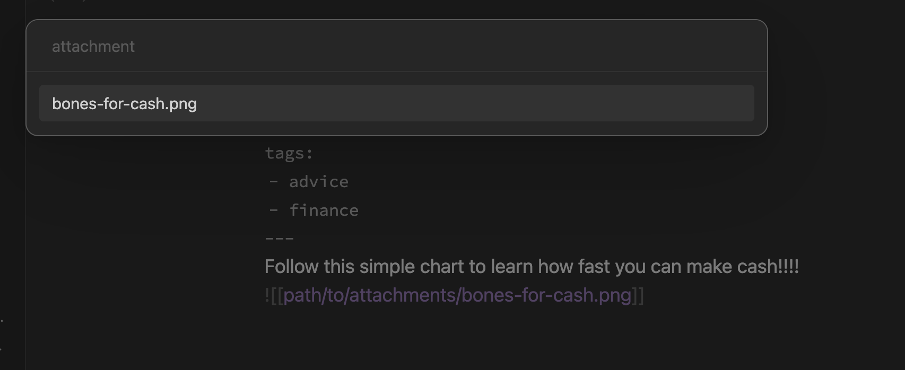

# obsidian-hugo-figure-template
A Templater script and template to insert a Hugo figure shortcode linked to one of the document's linked attachments.

# Motivation
Hugo's figure shortcodes are an easy way to make embedded media more accessible. They might make it more stylable but my only real concern was getting my embeds up to modern standards.

## Caveat
Hugo itself doesn't understand wikilinks of the form `[[target]]`, or with aliases, etc. There are tools like [Quartz](https://github.com/jackyzha0/quartz) which do the job [for you](https://github.com/jackyzha0/quartz/blob/hugo/layouts/partials/textprocessing.html#L12-L116) with some templating magic.

I'm assuming that you have something that can perform a similar task.

# Breakdown
## AttachmentSelector
This is the actually interesting part of the project. This snippet of code iterates through all the outlinks in a document, checks which ones have a type of `file`, and presents a unique list of those links. This is nice, because it doesn't even care what directory you keep your attachments in.
## The template
The template itself is really simple, just calling `attachmentSelector()` and linking to the file.
```

```

# Usage
`attachmentSelector.js` is intended to be used as a Templater [user script](https://silentvoid13.github.io/Templater/user-functions/script-user-functions.html). You'll want to configure Templater's user script directory, and drop it in there.

Similarly, `blog-figure.md` should be moved into your configured templates folder.

# Example
Let's say you've got a document that looks something like this:

```markdown
---
title: "How to make money selling your bones"
tags:
- advice
- finance
---
Follow this simple chart to learn how fast you can make cash!!!!
![[path/to/attachments/bones-for-cash.png]]
```

If you execute the template, you should see this:


Selecting your attachment will complete the process and emit your Hugo shortocde. This respects the stated assumption that Hugo or your publishing pipeline has some way of transforming Obsidian/wikilinks into something that Hugo understands.
```

```
